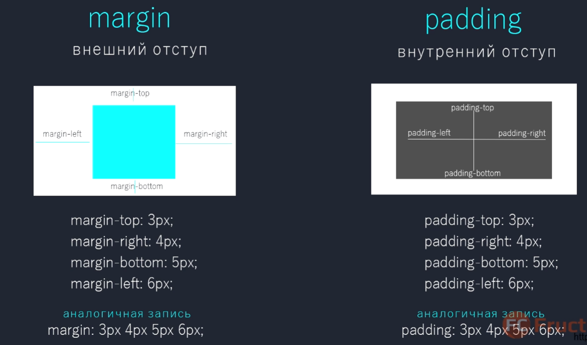

# CSS



margin — внешние отступы

padding — внутренние отступы


`letter-spacing` — интервал между букваими

`text-decoration`


`float` — прижать элемент к (`left`, `right`) краю

`list-style: none` — убирание точек в листе

`display: block` — неблочный элемент превратить в блочный

`overflow: hidden` — если что-то выходит за блок, то скрыть

`outline` — рамка не подсвечивается

`cursor: pointer` — меняет курсор на пальчик

# Адаптив под телефон

```html
@media only screen
and (min-device-width: 320px)
and (max-device-width: 568px)
```

